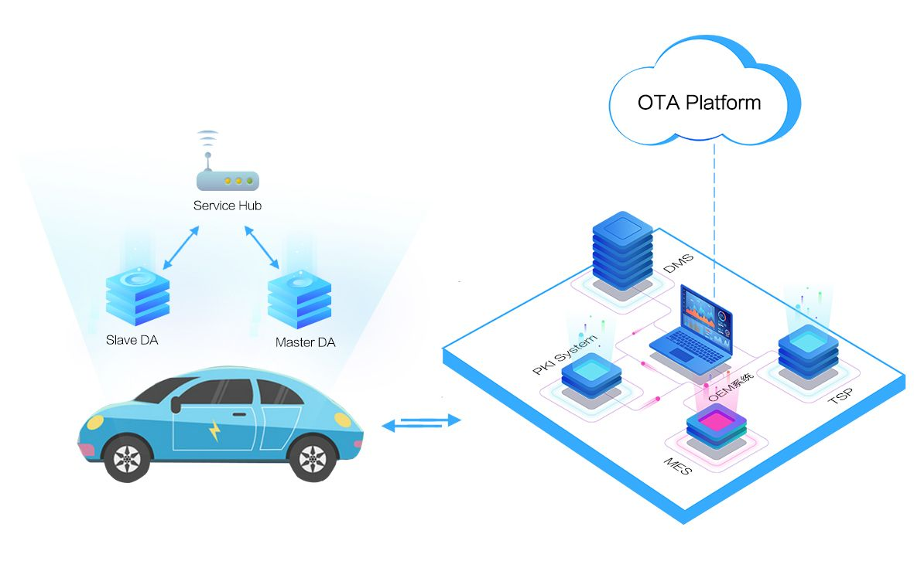
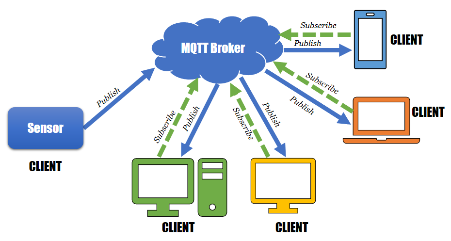

# IMT-ARM-Embedded-Diploma-Graduation-Project
Bootloader that can jump to execute APP1 or APP2 depending on input signal  
Micro-Controller used STM32F401  

### Team Members

- **Mohamed Ghoneim**
- **Abdullah Ayman**
- **Nour AL Dein**

## Introduction

* Embedded Systems Technology is leaping, one of the most leading ideas for upgrading your system is by adding the wifi connectivity and having to solve bugs and deploy update with a lower cost and effort, that's where the FOTA comes in !!

* Following this need, and designing the best solution, this led to having an applicaple supporting feature wich is over-the-air(OTA) updates.An OTA update replaces the software on the microcontroller or microprocessor of the embedded system with new software.

  

## Project Description

The Project is mainly targeting to upgrade the firmware of remote Hardware ECUs OTA . The project is a starting phase to create a portable platform to update remote ECUs with different methods and Hardware. 

## Project Overview

The Project is divided into 3 main Parts:
1. **The MQTT broker/server**
2. **ESP8266-(WIFI Connection)**
3. **Target Hardware Firmware (Bootloader)**

### The MQTT broker/server

  

### MQTT (Message Queuing Telemetry Transport) brokers:
**They are messaging middleware that enables communication between devices in a distributed IoT (Internet of Things) environment. They facilitate the exchange of lightweight messages between clients, following a publish/subscribe model.**

## Connecting to an MQTT Broker:
**To connect to an MQTT broker, you need to specify the broker's address (IP or hostname) and port. Typically, you'll also need a client ID for identification. Use a client library compatible with your programming language or platform to establish the connection.**

## Subscribing to Topics:
**After connecting to the MQTT broker, clients can subscribe to topics of interest. Topics act as channels for message distribution. Clients receive messages published to topics they're subscribed to. Topics are hierarchical and can use wildcards for flexible subscription patterns.**

## Publishing Messages:
**Clients can publish messages to specific topics on the broker. Messages can contain data payloads or commands. Publishers specify the topic they're publishing to, and the broker distributes the message to all subscribed clients interested in that topic.**  

### ESP8266-(WIFI Connection)

  

## How to use  
Burn the binary fileof each  to the specified location in Linker Script:  
BOOTLOADER in address 0x08000000  
APP1 in address 0x08006400  
APP2 in address 0x800C800 
  
The video included in the repo shows how it works  
