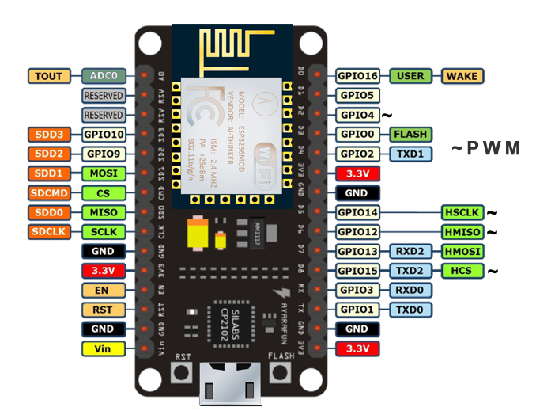

# IMT-ARM-Embedded-Diploma-Graduation-Project
Bootloader that can jump to execute APP1 or APP2 depending on input signal  
Micro-Controller used STM32F401  

### Team Members

- **Mohamed Fathy Ghoneim**
- **Abdullah Ayman EL Bakh**
- **Nour AL Dein Abo Bakr**

## Introduction

* Embedded Systems Technology is leaping, one of the most leading ideas for upgrading your system is by adding the wifi connectivity and having to solve bugs and deploy update with a lower cost and effort, that's where the FOTA comes in !!

* Following this need, and designing the best solution, this led to having an applicaple supporting feature wich is over-the-air(OTA) updates.An OTA update replaces the software on the microcontroller or microprocessor of the embedded system with new software.

  

## Project Description

The Project is mainly targeting to upgrade the firmware of remote Hardware ECUs OTA . The project is a starting phase to create a portable platform to update remote ECUs with different methods and Hardware. 

## Project Overview

The Project is divided into 3 main Parts:
1. **The MQTT broker/server**
2. **ESP8266-(WIFI Connection)**
3. **Target Hardware Firmware (Bootloader)**

### The MQTT broker/server

  

### MQTT (Message Queuing Telemetry Transport) brokers:
**They are messaging middleware that enables communication between devices in a distributed IoT (Internet of Things) environment. They facilitate the exchange of lightweight messages between clients, following a publish/subscribe model.**

## Connecting to an MQTT Broker:
**To connect to an MQTT broker, you need to specify the broker's address (IP or hostname) and port. Typically, you'll also need a client ID for identification. Use a client library compatible with your programming language or platform to establish the connection.**

## Subscribing to Topics:
**After connecting to the MQTT broker, clients can subscribe to topics of interest. Topics act as channels for message distribution. Clients receive messages published to topics they're subscribed to. Topics are hierarchical and can use wildcards for flexible subscription patterns.**

## Publishing Messages:
**Clients can publish messages to specific topics on the broker. Messages can contain data payloads or commands. Publishers specify the topic they're publishing to, and the broker distributes the message to all subscribed clients interested in that topic.**  

# ESP8266-(WIFI Connection)

  

## The ESP8266 NodeMCU:
**it is a popular development board based on the ESP8266 WiFi module. It's widely used in IoT (Internet of Things) projects due to its low cost, small form factor, and built-in WiFi capabilities. The NodeMCU development board integrates the ESP8266 module with additional features like USB connectivity and GPIO pins, making it easy to prototype IoT applications.**

## Features:
**WiFi Connectivity: The ESP8266 NodeMCU has built-in WiFi support, allowing it to connect to wireless networks. It supports both station (client) and access point (AP) modes, enabling it to connect to existing networks or create its own network.**

## GPIO Pins: 
**The NodeMCU board features GPIO (General Purpose Input/Output) pins, which can be used to interface with various sensors, actuators, and other electronic components. These pins enable versatile connectivity for building IoT applications.**

## USB Connectivity: 
**The NodeMCU board includes a USB interface, simplifying the programming and power supply for the board. It can be easily connected to a computer for programming and debugging purposes.**

## Arduino IDE Support: 
**The NodeMCU can be programmed using the Arduino IDE, making it accessible to a wide range of developers familiar with the Arduino ecosystem. This allows for easy development and deployment of IoT projects.**

## Connecting to WiFi:
**To connect the ESP8266 NodeMCU to a WiFi network, you can use the Arduino IDE along with the ESP8266WiFi library.**

# Target Hardware Firmware (Bootloader)

* The Remote Hardware that needed to be updated with new Fireware, needs to already have a firmware to receive the updated file and flash it on the Hardware ROM. this Firmware called **Bootloader** in which contains Transmission protocol, communication protocol and Flashing Sequence.

* The Bootloader Firmware is Targeted depended which means every Family of ECU needs a standalone Bootloader.

## How to use  
Burn the binary fileof each  to the specified location in Linker Script:  
BOOTLOADER in address 0x08000000  
APP1 in address 0x08006400  
APP2 in address 0x800C800 
  
The videos included in the repo shows how it works 

## Future Enhancements

   1. Upgrade the Communication protocol between NodeMCU and Target Hardware (STM) to a higher speed communication protocol (Ex: CAN - SPI).
   2. Applying a CyberSecurity protocols such as encryptions to the Communication between the PC and The Target Hardware.
